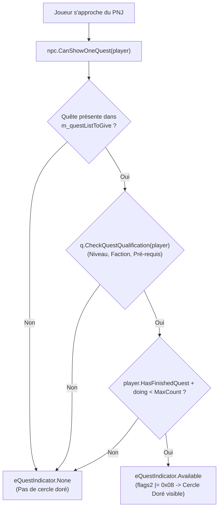

# 📘 Guide des Bonnes Pratiques & Retours d'Expérience - Système de Quêtes (OpenDAoC / Amtenaël)

Ce document récapitule l'ensemble des règles d'ingénierie logicielle C#, du cycle de vie du moteur Dawn of Light (DOL), des directives de base de données MariaDB et des protocoles de paquets client appris et validés sur le **Système de Quêtes d'Amtenaël**.

---

## 1. ⚙️ Cycle de Vie DOL & Timing d'Initialisation des Quêtes

> [!IMPORTANT]
> Ne JAMAIS initialiser les écouteurs d'interactions de quêtes (`Interact`, `WhisperReceive`) ni exécuter `AddQuestToGive()` sur des PNJs de base de données durant l'événement `[ScriptLoadedEvent]`.

### 1.1 `[ScriptLoadedEvent]` vs `[GameServerStartedEvent]`

Dans l'architecture du serveur de jeu :
1. **Compilation des Scripts (`ScriptMgr.Init()`)** :
   - L'événement `[ScriptLoadedEvent]` se déclenche dès la fin de la compilation C#.
   - **À cet instant précis, les régions (`Region`) et les PNJs stockés en BDD (table `mob`) ne sont PAS ENCORE chargés dans `WorldMgr`**.
   - Tout appel à `WorldMgr.GetNPCsFromRegion()` ou `WorldMgr.GetNPCsByName()` renvoie donc `null` ou une liste vide.
   - Si un script tente de chercher un PNJ à ce stade et instancie un `new GameNPC()` de secours avec `AddToWorld()`, ce PNJ sera un doublon "fantôme" qui sera ensuite masqué ou ignoré lorsque le vrai PNJ de la base de données sera chargé !
2. **Chargement de la Base de Données (`WorldMgr.LoadFromDatabase()`)** :
   - Le serveur itère sur toutes les régions et charge les milliers de PNJs de la table `mob`.
3. **Démarrage Complet du Serveur (`GameServer.Start()`)** :
   - L'événement `[GameServerStartedEvent]` se déclenche à la toute fin de l'initialisation du serveur, **après** le chargement complet du monde.
   - `WorldMgr.GetNPCsFromRegion(regionId)` contient désormais l'ensemble des PNJs réels et actifs.

### 1.2 Modèle d'Initialisation Recommandé

```csharp
[GameServerStartedEvent]
public static void OnServerStarted(DOLEvent e, object sender, EventArgs args)
{
    InitQuest();
}

[ScriptLoadedEvent]
public static void ScriptLoaded(DOLEvent e, object sender, EventArgs args)
{
    // Enregistrement des événements globaux joueurs
    GameEventMgr.AddHandlerUnique(GamePlayerEvent.AcceptQuest, new DOLEventHandler(SubscribeQuest));
    GameEventMgr.AddHandlerUnique(GamePlayerEvent.DeclineQuest, new DOLEventHandler(SubscribeQuest));
}

public static void InitQuest()
{
    if (!ServerProperties.Properties.LOAD_QUESTS)
        return;

    GameNPC questNPC = MonPNJ; // Accesseur dynamique via WorldMgr

    if (questNPC == null)
    {
        // Création de secours uniquement si le PNJ n'existe pas en BDD
        questNPC = new GameNPC();
        // ... propriétés ...
        questNPC.AddToWorld();
    }

    // Gestionnaires d'événements uniques (évite les doublons)
    GameEventMgr.AddHandlerUnique(GamePlayerEvent.AcceptQuest, new DOLEventHandler(SubscribeQuest));
    GameEventMgr.AddHandlerUnique(GamePlayerEvent.DeclineQuest, new DOLEventHandler(SubscribeQuest));
    GameEventMgr.AddHandlerUnique(questNPC, GameObjectEvent.Interact, new DOLEventHandler(TalkToMonPNJ));
    GameEventMgr.AddHandlerUnique(questNPC, GameLivingEvent.WhisperReceive, new DOLEventHandler(TalkToMonPNJ));

    // Attachement de la quête au PNJ réel
    questNPC.AddQuestToGive(typeof(MaQuete));
}
```

---

## 2. 🟡 Indicateur Visuel Client ("Cercle Doré" sous les pieds du PNJ)

> [!TIP]
> L'effet visuel de quête disponible (cercle doré / quest ring) est calculé dynamiquement par le serveur à chaque fois qu'un joueur s'approche du PNJ.

### 2.1 Fonctionnement du Paquet Réseau (`PacketLib1124`)

Lorsqu'un joueur entre dans la zone de visibilité d'un PNJ :
1. Le serveur génère le paquet de création/mise à jour du PNJ (`CreateNPCPacket`).
2. Le serveur interroge `npc.GetQuestIndicator(player)`.
3. Si `GetQuestIndicator` renvoie `eQuestIndicator.Available`, le serveur applique le flag binaire :
   ```csharp
   flags2 |= 0x08; // Indicateur visuel "Quête Disponible" (Cercle Doré)
   ```
4. Si `GetQuestIndicator` renvoie `eQuestIndicator.Finish`, le serveur applique :
   ```csharp
   flags2 |= 0x10; // Indicateur visuel "Quête Terminée à Rendre"
   ```

### 2.2 Chaîne de Validation d'Éligibilité (`CanShowOneQuest`)

Pour que `GetQuestIndicator(player)` renvoie `eQuestIndicator.Available`, l'évaluation suivante doit être vraie :



### 2.3 Piège Fréquent : Le Plafond `max_level`

- **Symptôme** : Un PNJ donneur de quête n'a pas de cercle doré lorsqu'un joueur de haut niveau (ex: niveau 50) ou un admin s'approche de lui.
- **Cause** : Si la quête a une condition stricte `player.Level >= minimumLevel && player.Level <= maximumLevel` avec un `maximumLevel` bas (ex: 16 ou 20), tout joueur de niveau supérieur à ce plafond est disqualifié.
- **Règle d'Or** : Pour les quêtes journalières/récurrentes ou d'initiation destinées à être testables ou accomplies par tous, **toujours définir `max_level = 60`** (ou `50`). La progression bas niveau est régie par le `min_level` d'accès.

---

## 3. 🔍 Résolution Dynamique des PNJs & Gestion des Royaumes

> [!WARNING]
> Dans la base de données MariaDB d'Avalon (Région 51), la majorité des PNJs ont `Realm = 0` (`eRealm.None`). La méthode native `WorldMgr.GetNPCsByName(name, eRealm.Albion)` échoue systématiquement à les trouver !

### 3.1 Pourquoi `WorldMgr.GetNPCsByName` échoue sur Avalon

Le code interne de `WorldMgr.GetNPCsByName` applique un filtre strict :
```csharp
if (obj.Realm == realm && obj.Name.Equals(name, StringComparison.OrdinalIgnoreCase))
```
Si le PNJ a `Realm = 0` en BDD et que l'on recherche avec `eRealm.Albion` (`1`), l'égalité `0 == 1` est fausse et le PNJ existant n'est jamais retourné.

### 3.2 La Solution : Accesseur Dynamique par Région & Coordonnées

Dans tous les scripts de quêtes et templates `QuestFactory`, la recherche s'effectue via `WorldMgr.GetNPCsFromRegion` avec comparaison insensible à la casse et tolérance spatiale de $\pm 100$ unités :

```csharp
private static GameNPC MonPNJ
{
    get
    {
        foreach (GameNPC npc in WorldMgr.GetNPCsFromRegion((ushort)NPC_REGION))
        {
            if (npc.Name.Equals(NPC_NAME, StringComparison.OrdinalIgnoreCase)
                && Math.Abs(npc.X - NPC_X) < 100
                && Math.Abs(npc.Y - NPC_Y) < 100)
            {
                return npc;
            }
        }
        return null;
    }
}
```

---

## 4. 🧹 Prévention des Fuites Mémoire & Doublons d'Événements

### 4.1 Utilisation Obligatoire de `AddHandlerUnique`

Lorsqu'un script s'initialise ou qu'une recharge à chaud intervient :
- `GameEventMgr.AddHandler()` ajoute un délégué **sans vérifier s'il est déjà présent**. Si la méthode est appelée deux fois, chaque clic de joueur déclenchera le dialogue deux fois !
- `GameEventMgr.AddHandlerUnique()` garantit que le délégué n'est enregistré qu'une seule et unique fois dans la collection du `GameObject`.

### 4.2 Déchargement Propre (`ScriptUnloadedEvent`)

Tout script doit implémenter `[ScriptUnloadedEvent]` pour retirer ses gestionnaires d'événements et supprimer la quête de la liste du PNJ :
```csharp
[ScriptUnloadedEvent]
public static void ScriptUnloaded(DOLEvent e, object sender, EventArgs args)
{
    GameNPC questNPC = MonPNJ;
    if (questNPC == null) return;

    GameEventMgr.RemoveHandler(GamePlayerEvent.AcceptQuest, new DOLEventHandler(SubscribeQuest));
    GameEventMgr.RemoveHandler(GamePlayerEvent.DeclineQuest, new DOLEventHandler(SubscribeQuest));
    GameEventMgr.RemoveHandler(questNPC, GameObjectEvent.Interact, new DOLEventHandler(TalkToMonPNJ));
    GameEventMgr.RemoveHandler(questNPC, GameLivingEvent.WhisperReceive, new DOLEventHandler(TalkToMonPNJ));

    questNPC.RemoveQuestToGive(typeof(MaQuete));
}
```
