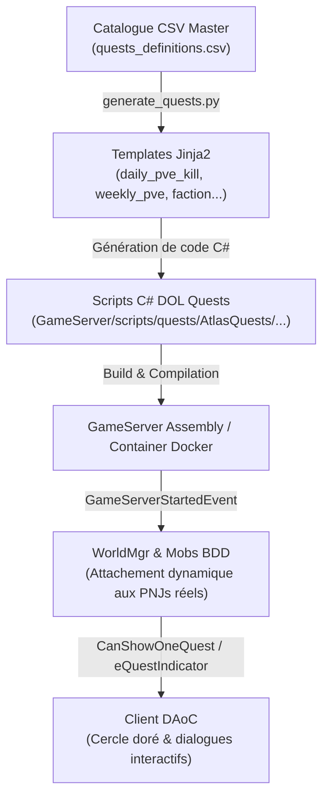

# 📜 Système de Quêtes d'Amtenaël / OpenDAoC

Bienvenue dans le dossier central d'ingénierie, de documentation et de suivi du **Système de Quêtes d'Amtenaël**.
Ce dossier regroupe l'architecture technique, les guides de bonnes pratiques, le catalogue des quêtes par région et le suivi des déploiements.

---

## 🗺️ Vue d'Ensemble de l'Architecture

Le système de quêtes repose sur une chaîne outillée et modulaire :



---

## 📂 Navigation & Documents de Référence

| Document | Description | Statut |
| :--- | :--- | :---: |
| [**GUIDE_ET_BONNES_PRATIQUES_QUETES.md**](GUIDE_ET_BONNES_PRATIQUES_QUETES.md) | **Guide d'ingénierie & retours d'expérience** : cycle de vie DOL, timing d'initialisation, indicateur visuel (cercle doré), règles de filtrage de niveau et de royaume. | 📘 Référence |
| [**SUIVI_DES_QUETES.md**](SUIVI_DES_QUETES.md) | **Tableau de bord et suivi des chantiers** : état des lots par région, statut de validation in-game, quêtes actives vs quêtes archivées. | 📊 Actif |
| [**CATALOGUE_QUETES_REGION51.md**](CATALOGUE_QUETES_REGION51.md) | **Spécification détaillée des quêtes d'Avalon (Région 51)** : Caer Gothwaite, Bastion des Paladins de Tyr, PNJ donneurs, coordonnées, dialogues et cibles. | 🏰 Validé |

---

## 📁 Organisation des Dossiers Liés

```text
📁 C:\OpenDAOC_server\ProjetsAnnexes\AmteManagerV2\
├── 📁 Quêtes\                                              # 📌 Dossier de documentation master & suivi
│   ├── 📄 README.md                                       #   -> Ce fichier d'accueil et index
│   ├── 📄 GUIDE_ET_BONNES_PRATIQUES_QUETES.md              #   -> Règles d'or, pièges moteur & solutions
│   ├── 📄 SUIVI_DES_QUETES.md                             #   -> Tableau de bord des quêtes et déploiements
│   └── 📄 CATALOGUE_QUETES_REGION51.md                    #   -> Spécifications détaillées Région 51
│
├── 📁 QuestFactory\                                       # 🏭 Usine de génération de quêtes (IA / Jinja2 / CSV)
│   ├── 📄 quests_definitions.csv                          #   -> Catalogue CSV source des quêtes
│   ├── 📄 generate_quests.py                              #   -> Moteur de génération Python / Jinja2
│   ├── 📁 templates/                                      #   -> Gabarits C# (.cs.j2)
│   └── 📁 archives/                                       #   -> Sauvegardes historiques des CSV
│
├── 📁 app\                                                # 🌐 Interface Web AmteManagerV2 (Vue.js / Vite)
│   └── 📁 src\views\                                      #   -> Vues UI dont QuestFactory pour l'édition visuelle
│
├── 📁 ProjetsAnnexes\DossierPortage\Archives\               # 📦 Archives des anciens scripts retirés
│   └── 📁 Quests_Archive_Region51\                        #   -> 11 anciens scripts Shrouded Isles / Lyonesse
│
└── 📁 ProjetsAnnexes\OpenDAoC-SPB\GameServer\scripts\quests\  # 💾 Code source C# actif dans le serveur
    └── 📁 AtlasQuests\                                    #   -> Quêtes actives générées et de faction
```

---

## 🌐 Interface Web AmteManagerV2 & QuestFactory

QuestFactory est intégré à l'outil web d'administration **AmteManagerV2** (port `8082` en local) :
- Permet la visualisation et la saisie ergonomique de quêtes via une interface graphique interactive.
- Les données sont exportables et synchronisées avec `quests_definitions.csv`.
- Le générateur `generate_quests.py` transforme ces définitions en scripts C# DOL prêts à compiler.

---

## ⚙️ Outils & Génération Automatisée (`QuestFactory`)

Pour générer ou mettre à jour les quêtes C# à partir du catalogue CSV :
```powershell
cd C:\OpenDAOC_server\ProjetsAnnexes\AmteManagerV2\QuestFactory
python generate_quests.py --overwrite
```
Puis recompiler le serveur :
```powershell
cd C:\OpenDAOC_server\ProjetsAnnexes\OpenDAoC-SPB
dotnet build DOLLinux.sln -c Release
docker compose up -d --build gameserver
```
