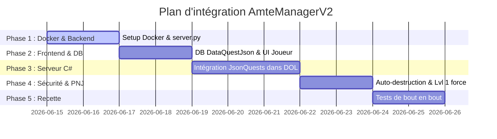

# Plan d'implémentation - AmteManagerV2 & Chargement Dynamique de Quêtes

Ce plan décrit les étapes de développement, d'intégration et de test pour porter **AmteManagerV2** et intégrer le chargeur dynamique de quêtes JSON dans le serveur **OpenDAoC-SPB**.

## Objectifs du Plan
1. **Sécurité & Isolation** : Exécution de l'interface d'administration sous Docker, sans exposer directement le port MariaDB `3306` sur l'hôte Windows.
2. **Chargement dynamique (Base de données)** : Port du système de quêtes JSON (`JsonQuests` de Breamor) sur le serveur de jeu, permettant de charger/modifier des quêtes sans redémarrer le serveur.
3. **Sécurisation Joueur** : Restreindre l'interface aux fonctionnalités de joueur, forcer des PNJ de niveau 1 et implémenter l'auto-destruction après 14 jours.

---

## Proposition de Planification Étape par Étape

---

## Étape 1 : Conteneurisation & Backend Python
* **Objectif** : Configurer le serveur API Python local pour qu'il s'exécute dans Docker et communique en interne avec le conteneur de base de données.

### Modifications proposées
#### [NEW] [server.py](file:///C:/OpenDAOC_server/ProjetsAnnexes/AmteManagerV2/server.py)
* Écrire le script Python utilisant `http.server` ou un micro-serveur natif.
* Gérer les routes :
  - `/api/login` : Vérification du nom d'utilisateur et hachage du mot de passe (comparaison avec la table `account` de la base MariaDB `opendaoc`).
  - `/api/db/query` : Proxy SQL filtré. Pour les joueurs (`PrivLevel = 1`), seules les requêtes SELECT/INSERT/UPDATE sur la table `dataquestjson` (avec vérification du créateur) et les requêtes SELECT d'aide (ex: listes de PNJ) sont autorisées.
  - Servir le dossier `dist/` du frontend.

#### [NEW] [Dockerfile](file:///C:/OpenDAOC_server/ProjetsAnnexes/AmteManagerV2/Dockerfile)
* Dockerfile multi-stage pour compiler l'application Vue (`npm run build`) puis l'exécuter avec le script `server.py`.

#### [MODIFY] [docker-compose.yml](file:///C:/OpenDAOC_server/ProjetsAnnexes/OpenDAoC-SPB/docker-compose.yml)
* Ajouter le service `amtemanager` lié au réseau `opendaoc-network`.
* Mapper un port externe (ex: `8082:80`) pour accéder à l'interface sur Windows.

### Plan de Vérification
* Lancement de `docker compose up` sur le serveur.
* Validation que l'interface s'affiche sur `http://localhost:8082`.
* Test de connexion avec un compte existant de la base de données.

---

## Étape 2 : Initialisation de la Base de Données & Filtrage Frontend
* **Objectif** : Créer la table nécessaire et adapter le frontend pour restreindre l'accès à un joueur normal.

### Modifications proposées
#### [NEW] [init_dataquestjson.sql](file:///C:/OpenDAOC_server/ProjetsAnnexes/AmteManagerV2/init_dataquestjson.sql)
* Créer la table `dataquestjson` dans la base `opendaoc`.
* **Sécurité** : Ajouter une colonne `CreatorAccount` (varchar) pour lier chaque quête à son auteur.

#### [MODIFY] [Vues frontend](file:///C:/OpenDAOC_server/ProjetsAnnexes/AmteManagerV2/app/src/)
* Mettre à jour les modèles et formulaires pour gérer la colonne `CreatorAccount` et retirer les boutons superflus pour le profil joueur.
* Masquer tous les menus GM/Admin (Loot, Spells, Items) dans le menu principal pour les utilisateurs ordinaires.

### Plan de Vérification
* Importation du script SQL dans MariaDB via PHPMyAdmin ou commande Docker.
* **Important** : Pour appliquer les modifications du frontend dans le conteneur Docker, exécuter la commande de reconstruction :
  `docker compose up -d --build amtemanager`
* Validation que seul le module de création de quêtes (avec la carte Leaflet d'Avalon) est accessible après connexion.

---

## Étape 3 : Intégration du chargeur de quêtes C# (`JsonQuests`)
* **Objectif** : Porter le chargeur de quêtes dynamique de Breamor sur le serveur de jeu OpenDAoC-SPB.

### Modifications proposées
#### [MODIFY] [Fichiers JsonQuests](file:///C:/OpenDAOC_server/ProjetsAnnexes/OpenDAoC-SPB/GameServer/quests/JsonQuests/)
* Nettoyer les fichiers copiés pour remplacer toutes les références à `BreamorFactionMgr` par :
  - Soit le système de faction standard de DOL (`FactionMgr.GetFactionByID(1020)` pour Tyr).
  - Soit rendre la récompense de faction facultative pour le moment.

#### [MODIFY] Modificateurs Noyau C#
* Intégrer les hooks nécessaires dans les classes de base :
  - #### [MODIFY] [GameNPC.cs](file:///C:/OpenDAOC_server/ProjetsAnnexes/OpenDAoC-SPB/GameServer/gameobjects/GameNPC.cs)
    Ajouter la gestion de la liste `m_questIdListToGive` et les méthodes associées pour afficher l'indicateur de quête (Point d'exclamation).
  - #### [MODIFY] [GameObject.cs](file:///C:/OpenDAOC_server/ProjetsAnnexes/OpenDAoC-SPB/GameServer/gameobjects/GameObject.cs)
    Ajouter l'interception de l'événement `Interact` pour notifier `DataQuestJsonMgr`.
  - #### [MODIFY] [GamePlayer.cs](file:///C:/OpenDAOC_server/ProjetsAnnexes/OpenDAoC-SPB/GameServer/gameobjects/GamePlayer.cs)
    Ajouter les méthodes utilitaires `HasFinishedQuest` et `IsDoingQuest` spécifiques aux quêtes JSON.
  - #### [MODIFY] [DetailDisplayHandler.cs](file:///C:/OpenDAOC_server/ProjetsAnnexes/OpenDAoC-SPB/GameServer/packets/Client/168/DetailDisplayHandler.cs)
    Permettre au client d'afficher les détails des quêtes dynamiques dans le journal de quêtes du joueur.

### Plan de Vérification
* Compilation du serveur de jeu C# dans Docker et validation qu'aucun bug de compilation n'apparaît.
* Lancement du jeu et exécution de la commande `/quest reload` en jeu pour vérifier que le chargeur s'initialise.

---

## Étape 4 : Sécurité & Auto-destruction des PNJ Temporaires [COMPLÉTÉE]
* **Objectif** : Forcer les restrictions imposées aux joueurs pour éviter les abus de création de monstres/PNJ.

### Modifications réalisées
#### C# Quest Engine & Server.py [COMPLÉTÉ]
* Dans le backend Python : Forcer le niveau des PNJ générés à 1 lors de l'insertion en DB (filtrage/sanitisation de `GoalsJson` et `CreatorAccount`).
* Dans le chargeur C# :
  - Mapping de `CreatorAccount` pour identifier les quêtes de joueurs.
  - Forçage du niveau du PNJ de quête à 1 si `CreatorAccount != "System"`.
  - Enregistrement de la date de création (`DateTime.UtcNow`).
  - Implémentation d'un timer `ECSGameTimer` d'auto-destruction : si `DateTime.UtcNow > CreationDate + 14 jours` (ou 5 minutes en mode test rapide `SpeedUpPlayerQuestNPCDestruction = true`), appeler `npc.Delete()`.

### Plan de Vérification
* Modification temporaire du délai d'auto-destruction à **5 minutes** pour les tests.
* Création d'une quête, spawn du PNJ, et vérification que le PNJ disparaît automatiquement après 5 minutes.

---

## Étape 5 : Tests de bout en bout
* **Objectif** : Valider l'ensemble du cycle de vie d'une quête créée par un joueur.

### Plan de Vérification
1. Connexion à l'interface AmteManagerV2 avec un compte joueur test.
2. Création visuelle d'une quête avec Leaflet (dialogue avec un PNJ, déplacement dans une zone, clic de coordonnées).
3. Sauvegarde de la quête (vérification de l'écriture en DB).
4. Commande de rechargement en jeu ou déclenchement automatique de rechargement.
5. Vérification de l'apparition physique du PNJ de niveau 1 au point cliqué.
6. Réalisation complète de la quête avec un personnage joueur en jeu.
7. Validation que les quêtes des autres joueurs ne sont ni modifiables ni supprimables par le compte test.
